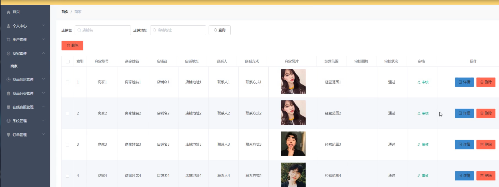

基于Springboot的免税商品优选购物商城（程序+论文）
=
### 完整代码获取地址：从戎源码网 ([https://armycodes.com/](https://armycodes.com/))
### 作者微信：19941326836  QQ：952045282 
### 承接计算机毕业设计、Java毕业设计、Python毕业设计、深度学习、机器学习
### 选题+开题报告+任务书+程序定制+安装调试+论文+答辩ppt 一条龙服务
### 所有选题地址https://github.com/nature924/allProject

一、项目介绍
---
系统包含两种角色：用户、管理员，系统分为前台和后台两大模块，主要功能如下：

 登录界面
用户通过登录窗口输入用户名和密码进行登录操作。

 管理员功能模块
管理员登录成功后，可以访问个人中心、用户管理、商家管理、商品分类管理、商品信息管理、在线客服管理、系统管理、订单管理等功能模块。

- 用户管理  
  通过列表获取账号、用户名、姓名、性别、头像、联系电话、照片、地址等信息，并进行查看详情、修改或删除操作。

- 商家管理  
  通过列表获取商家的详细信息内容，并进行查看详情或删除操作。

- 订单管理  
  通过列表获取订单编号、商品名称、商品图片、购买数量、价格、总价格、支付类型、状态、地址等信息，并进行查看详情或发货、删除操作。

 商家功能模块
商家登录后台系统后可以访问个人中心、商品信息管理、商品分类管理、在线客服管理、订单管理等功能模块。

- 商家信息  
  查看员工的基本信息，并进行查看或修改操作。

- 商品信息管理  
  通过列表获取商品名称、商品类型、规格、图片、商家账号、商家姓名、价格等信息，并进行查看详情、在线客服、查看评论、新增或删除操作。

- 在线客服管理  
  通过列表获取客服编号、内容、账号、姓名、商家账号、商家姓名、客服回复等信息，并进行查看详情、修改、删除操作。

- 我的收藏管理  
  通过列表获取收藏名称、收藏图片等信息，并进行查看详情、修改或删除操作。

- 订单管理  
  通过列表获取订单编号、商品名称、商品图片、购买数量、价格、总价格、支付类型、状态、地址等信息，并进行查看详情或删除操作。

 用户前台功能模块
用户通过免税商品优选购物商城系统可以查看首页、商品信息、商城快讯、个人中心、后台管理、购物车等功能。

- 商品信息详情  
  查看商品名称、价格、类型、规格、商家账号、商家姓名、点击次数等信息，并可以添加到购物车或立即购买、收藏商品。

- 个人中心  
  访问个人中心、我的订单、我的地址、我的收藏四个子模块。  
  - 个人信息  
    查看和更新个人信息。  
  - 我的订单  
    查看订单编号、商品、价格、数量、总价、地址等信息，并进行订单查看或退款操作。  
  - 我的地址  
    查看联系人、手机号码、地址等信息，并进行查看、修改、删除操作，以及添加新地址。

 用户后台功能模块
用户通过后台管理进入后台系统可以访问个人中心、商品信息管理、在线客服管理、我的收藏管理、订单管理等功能模块。

- 在线客服管理  
  查看客服编号、内容、账号、姓名、商家账号、商家姓名、客服回复等信息，并进行查看详情操作。

- 商品信息管理  
  查看商品名称、商品类型、规格、图片、商家账号、商家姓名、价格等信息，并进行查看详情、在线客服、查看评论、新增或删除操作。

二、项目技术
---
- 编程语言：Java
- 数据库：MySQL
- 项目管理工具：Maven
- 前端技术：VUE、HTML、Jquery、Bootstrap
- 后端技术：Spring、SpringMVC、MyBatis

三、运行环境
---
- 操作系统：Windows、macOS都可以
- JDK版本：JDK1.8以上都可以
- 开发工具：IDEA、Ecplise、Myecplise都可以
- 数据库: MySQL5.7以上都可以
- Tomcat：任意版本都可以
- Maven：任意版本都可以

四、运行截图
---
### 论文截图：

### 程序截图：

